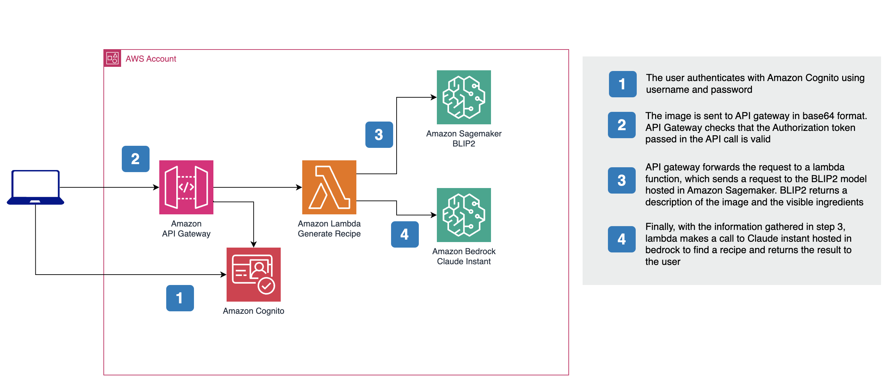

# Recipe generation 

This solution provides an example of how to create an end-to-end solution to inference images of food/dishes and create a recipe.

## Demo
You can access a deployed instance of this solution at https://recipe-generation.com

For simplicity, the demo has a pre-defined set of images for the user to choose instead of allowing uploads.

## Infrastructure

The infrastructure is based on:
1. Amazon API Gateway - Entry point to send images as base64 and return recipes 
2. Amazon Lambda Function - Processes the image invoking the BLIP2 and generates a recipe with Claude instant
3. Amazon Cognito - Provides authentication for the API
4. Amazon Sagemaker - Used to host the BLIP2 model
5. Amazon Bedrock - Used for inference requests to Claude instant

Most of the deployment of the infrastructure is automated using the Serverless Application Model. For detail instructions, follows the steps [here](./infrastructure/README.md)

## Web portal

Example single page application built in Vue JS - it is integrated with Cognito to provide a seamlessly  experience, allowing users to sign up and sign in. 

Detail instructions can be found [here](./web-portal/README.md)

## Support

Please open an issue for any questions or issues
